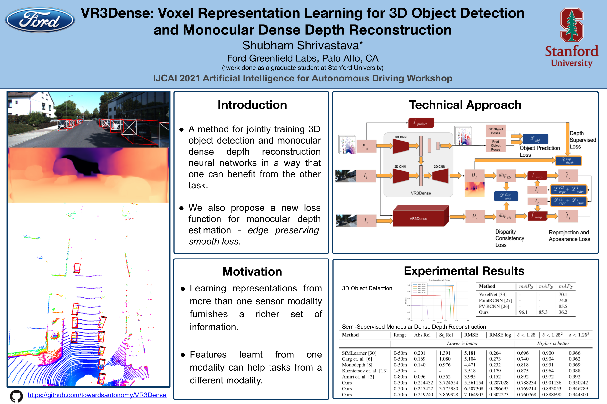

# VR3Dense: Voxel Representation Learning for 3D Object Detection and Monocular Dense Depth Reconstruction  

This is the official implementation of VR3Dense. 
 
### [[**Paper**](https://arxiv.org/abs/2104.05932)] [[**Video**](https://youtu.be/IkghXUdQTLs)]   

  

VR3Dense jointly trains for 3D object detection as well as semi-supervised dense depth reconstruction. Object detection uses 3D convolutions over voxelized point-cloud to obtain 3D bounding-boxes, while dense depth reconstruction network uses an *hourglass* architecture with skip connections. The complete pipeline has been trained on KITTI object training dataset with 90% train and 10% validation split. VR3Dense supports detection and classification of the following classes: ```Car, Cyclist, Pedestrian```. VR3Dense runs at about **141.1fps** on a PC with i9 10850K processor with single NVIDIA RTX 3090 GPU.  

## Model Predictions 
 

|     |    |
|:---:|:---:|
| *Figure 1 - VR3Dense tested on KITTI raw dataset / Date:2011-09-26 / Sequence: 0009*   | *Figure 2 - VR3Dense tested on KITTI raw dataset / Date:2011-09-26 / Sequence: 0104* | 

   
*Figure 3 - RGB unprojection with predicted depth*  

## Getting Started

 - Clone this project as: ```git clone https://github.com/towardsautonomy/VR3Dense.git```.    
 - We recommend either using a docker image or setting up a *conda* environment.
    - For docker, we provide a docker image registry which can be pulled. We also provide a *Dockerfile* if you want to build one locally. For running within the docker image, run: `cd environments && sh run-docker.sh`.  
    - For conda, we provide the requirements file. Install conda environment as: ```conda env create -f conda_env.yml```.   

## Demo  

 - To run the demo, download one of the drive sequences from KITTI raw dataset. e.g. Download the drive sequence **2011_09_26_drive_0009** as: 
   ```
   wget https://s3.eu-central-1.amazonaws.com/avg-kitti/raw_data/2011_09_26_drive_0009/2011_09_26_drive_0009_sync.zip
   ```    

 - Run the following command:  
   ```
    python test.py --pc_dir {DATA_PATH}/2011_09_26_drive_0009_sync/velodyne_points/data \
                   --img_dir {DATA_PATH}/2011_09_26_drive_0009_sync/image_02/data \
                   --learning_rate=0.0001 --n_xgrids=16 --n_ygrids=16 --dense_depth --concat_latent_vector --exp_id=kitti
   ```

## Training, Testing, and Evaluation of VR3Dense  

### 1. Training on KITTI Object Dataset

Download *left*, *right*, *velodyne* data, and *labels* from here: http://www.cvlibs.net/datasets/kitti/eval_object.php?obj_benchmark=3d and extract them. 
The network can be trained as: 

```
python train.py --dataroot={KITTI_OBJECT_TRAINING_DATAROOT} \
                --epochs=100 --batch_size=8 --learning_rate=0.0001 --n_xgrids=16 --n_ygrids=16 --exp_id=kitti \
                --dense_depth --concat_latent_vector 
```

Or alternatively, you can run the provided bash script as: ```./run_experiments train```.  

### 2. Testing the pre-trained model on KITTI dataset

You need a set of *left image* files and the corresponding *velodyne point-cloud* files during testing. You can download KITTI raw, or object dataset for testing. Set up the paths correctly in *test.py* and then run:

```
python test.py --pc_dir {KITTI_DATAROOT}/velodyne_points/data \
               --img_dir {KITTI_DATAROOT}/image_02/data \
               --learning_rate=0.0001 --n_xgrids=16 --n_ygrids=16 --exp_id=kitti --dense_depth --concat_latent_vector 
```

This will download the pre-trained model if you do not have it locally and then run inference on it. You can choose to use a multi-object tracker by modifying the *TRACKING* parameter within *test.py*. This work uses **[AB3DMOT](https://github.com/xinshuoweng/AB3DMOT)** for multi-object tracking.

The network can also be tested by simply running: ```./run_experiments test```.  

A demo of the inference pipeline is shown in ```src/misc/demo.ipynb```.

### 3. Evaluation of the model on KITTI dataset

For evaluation of the model, you need a set of *left image* files and the corresponding *velodyne point-cloud* files. Set up the paths correctly in *src/eval_kitti.py* and then run: 

```
python src/eval_kitti.py --pc_dir {KITTI_VAL_SPLIT_DATAROOT}/velodyne \
                         --img_dir {KITTI_VAL_SPLIT_DATAROOT}/image_2 \
                         --learning_rate=0.0001 --n_xgrids=16 --n_ygrids=16 --exp_id=kitti --dense_depth --concat_latent_vector 
```

This will generate a set of *.txt* files for object detection, and compute *depth prediction* metrics for each file - which will be summarized at the end. Once you have obtained a set of *.txt* files, you can either use the *kitti object evaluation kit* to compute performance, or alternatively *zip* them and submit to KITTI evaluation server. Please follow [this](#kitti-evaluation) section for KITTI evaluation locally.

### 4. Ablation Study  

For ablation study, training and evaluation can be performed by running:   

```
./run_experiments train ablation
./run_experiments evaluate ablation
```

## Citation

If you find our work useful in your research, please cite this as:

```
@misc{shrivastava2021vr3dense,
      title={VR3Dense: Voxel Representation Learning for 3D Object Detection and Monocular Dense Depth Reconstruction}, 
      author={Shubham Shrivastava},
      year={2021},
      eprint={2104.05932},
      archivePrefix={arXiv},
      primaryClass={cs.CV}
}
```

## KITTI Evaluation

To write predicted labels to files in the KITTI format: ```./run_experiments evaluate```

Evaluations can be performed using KITTI object evaluation kit, included in this repo (kitti_devkit_object). This kit expects ground-truth in KITTI format, one *txt* file per frame, numbered sequentially starting from *000000.txt*. If using a KITTI dataset split, ```src/kitti_split.py``` can be used to randomly split the training set into train/val split and store the validation split by naming them sequentially. 

Evaluation kit has the following prerequisites:  
```
boost   (sudo apt-get install libboost-all-dev)
pdfcrop (sudo apt-get install texlive-extra-utils)
gnuplot (sudo apt-get install gnuplot)
```  

Install the prerequisites and follow the steps below to perform evaluations.

 - Open the file ```kitti_devkit_object/cpp/evaluate_object.cpp``` and update the number of validation samples by modifying the line ```const int32_t N_TESTIMAGES = 7518;```.   
 - Build binary.  

   ```
   cd kitti_devkit_object/cpp
   mkdir build
   cd build
   cmake ..
   make
   ```

 - Create a folder for ground truth files at ```build/data/object/``` and create a symlink for ground-truth folder.  

  ```
   mkdir -p data/object  
   cd data/object
   ln -s /path/to/groundtruth/object/label_2/ label_2
   cd ../../
  ```

 - Create a folder for current experiment at ```results/exp/```, where ```exp``` is the experiment id. Create a symlink for prediction folder within the experiment folder with name ```data```.  

  ```
   mkdir -p results/exp 
   cd results/exp
   ln -s /path/to/prediction/label/ data
   cd ../../
  ```

 - Run the evaluation kit with this experiment ID.  

 ```
  ./evaluate_object exp
 ```

 - This performs the evaluation and generates report with plots. 

 - A python script is also provided at ```kitti_devkit_object/cpp/parser.py``` to parse the report and summarize it.  

 ```
 cd ..
 python parser exp
 ```
